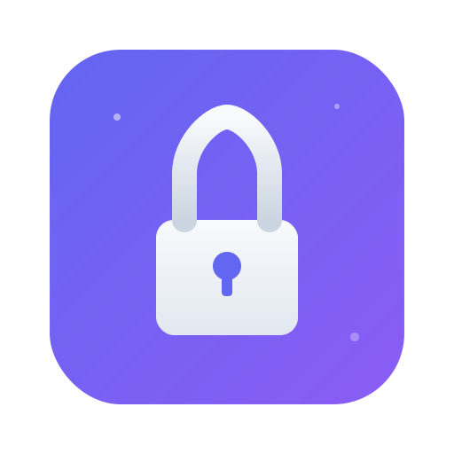

<p align="center">
  
</p>

<h1 align="center">Lockbox</h1>

<p align="center">
  <strong>Your passwords. Your server. Your rules.</strong><br/>
  A self-hosted password manager that runs entirely on Cloudflare's free tier.
</p>

<p align="center">
  <a href="#quick-start"></a>&nbsp;
  <a href="#features"></a>&nbsp;
  <a href="#architecture"></a>
</p>

<br/>

<p align="center">
  
  
  
</p>

---

## Why Lockbox?

Most password managers ask you to trust _their_ servers with your most sensitive data. Lockbox flips that model — **you host everything yourself**, on infrastructure you control, for **$0/month**.

No subscriptions. No data harvesting. No "we got breached" emails. Just a fast, modern password manager that **you** own end-to-end.

<table>
<tr>
<td width="50%">

### The Problem

- You're trusting a company with _every password you own_
- Breaches happen — even to password manager companies
- Monthly subscriptions for basic security
- Your vault data lives on servers you can't inspect

</td>
<td width="50%">

### The Lockbox Way

- **Self-hosted** on your own Cloudflare account
- **End-to-end encrypted** — the server never sees plaintext
- **Free forever** — runs on Cloudflare's generous free tier
- **Fully auditable** — every line of code is open source

</td>
</tr>
</table>

---

## Features

<table>
<tr>
<td align="center" width="25%">
  <h3>🔐</h3>
  <strong>Zero-Knowledge Encryption</strong><br/>
  <sub>Argon2id key derivation + AES-GCM. Your master password never leaves your device.</sub>
</td>
<td align="center" width="25%">
  <h3>🌍</h3>
  <strong>Access Everywhere</strong><br/>
  <sub>Web vault, browser extension (Chrome + Firefox), and Android app — all synced.</sub>
</td>
<td align="center" width="25%">
  <h3>⚡</h3>
  <strong>Blazing Fast</strong><br/>
  <sub>Cloudflare Workers respond in ~20ms globally. Edge computing, not data centers.</sub>
</td>
<td align="center" width="25%">
  <h3>🛡️</h3>
  <strong>2FA Built In</strong><br/>
  <sub>Store and generate TOTP codes alongside your passwords. One vault for everything.</sub>
</td>
</tr>
<tr>
<td align="center" width="25%">
  <h3>🎲</h3>
  <strong>Smart Generator</strong><br/>
  <sub>Generate strong passwords with real-time strength analysis powered by zxcvbn.</sub>
</td>
<td align="center" width="25%">
  <h3>📦</h3>
  <strong>1-Click Deploy</strong><br/>
  <sub>Clone, run one script, done. Your backend is live in under 2 minutes.</sub>
</td>
<td align="center" width="25%">
  <h3>💸</h3>
  <strong>Actually Free</strong><br/>
  <sub>Workers, D1, Pages — all on Cloudflare's free tier. No credit card required.</sub>
</td>
<td align="center" width="25%">
  <h3>🔓</h3>
  <strong>Open Source</strong><br/>
  <sub>MIT licensed. Audit it. Fork it. Make it yours. No vendor lock-in, ever.</sub>
</td>
</tr>
</table>

---

## Architecture

Lockbox is a monorepo with a clean separation between the API (the only server component) and multiple clients that talk to it.

```
┌─────────────────────────────────────────────────────────────┐
│                      YOUR CLOUDFLARE ACCOUNT                │
│                                                             │
│  ┌─────────────────────┐    ┌────────────────────────────┐  │
│  │  Cloudflare Workers  │    │    Cloudflare D1 (SQLite)  │  │
│  │                     │    │                            │  │
│  │  Hono API Server    │◄──►│  Encrypted Vault Storage   │  │
│  │  + Durable Objects  │    │                            │  │
│  └──────────┬──────────┘    └────────────────────────────┘  │
│             │                                               │
│  ┌──────────┴──────────┐                                    │
│  │  Cloudflare Pages   │                                    │
│  │  React Web Vault    │                                    │
│  └─────────────────────┘                                    │
└─────────────────────────────────────────────────────────────┘
              ▲
              │ HTTPS (E2E Encrypted payloads)
              │
   ┌──────────┴──────────────────────┐
   │          CLIENTS                │
   │                                 │
   │  🌐 Web Vault (React + Vite)   │
   │  🧩 Extension (WXT + React)    │
   │  📱 Mobile (Capacitor)         │
   └─────────────────────────────────┘
```

| Component     | Directory        | Stack                                   | Deploys To                     |
| ------------- | ---------------- | --------------------------------------- | ------------------------------ |
| **API**       | `apps/api`       | Hono · Drizzle · D1 · Durable Objects   | Cloudflare Workers             |
| **Web Vault** | `apps/web`       | React 19 · Vite · Tailwind v4 · Zustand | Cloudflare Pages               |
| **Extension** | `apps/extension` | WXT · React 19 · Zustand                | Chrome Web Store · Firefox AMO |
| **Mobile**    | `apps/mobile`    | Capacitor · Android                     | Google Play Store              |

### Shared Packages

| Package              | What it does                                                          |
| -------------------- | --------------------------------------------------------------------- |
| `@lockbox/crypto`    | Argon2id key derivation, AES-GCM encrypt/decrypt, zero-knowledge auth |
| `@lockbox/generator` | Password generation with zxcvbn strength scoring                      |
| `@lockbox/totp`      | TOTP code generation and validation                                   |
| `@lockbox/types`     | Shared TypeScript types across all apps                               |

---

## Quick Start

### Deploy the API (2 minutes)

```bash
git clone https://github.com/ryan12324/LockBox.git
cd lockbox
bun run deploy:api
```

That's it. The script handles everything:

1. ✅ Logs you into Cloudflare (if needed)
2. ✅ Installs dependencies
3. ✅ Creates a D1 database
4. ✅ Runs migrations
5. ✅ Deploys your Worker

You'll get your API URL:

```
✓ Worker deployed

  API URL: https://lockbox-api.YOUR_SUBDOMAIN.workers.dev
```

### Deploy the Web Vault (1 minute)

```bash
bun run deploy:web
```

The script will:

1. ✅ Ask for your API URL (or read from `VITE_API_URL` / `.env.local`)
2. ✅ Builds everything
3. ✅ Deploys to Cloudflare Pages

Your web vault will be live at `https://lockbox-web.pages.dev`.

### Build Other Clients

```bash
# Browser extension
VITE_API_URL=https://lockbox-api.YOUR_SUBDOMAIN.workers.dev bun run build --filter=@lockbox/extension
```

> 📖 **Full deployment guide** — including CI/CD, store submissions, and custom domains — in **[DEPLOYING.md](DEPLOYING.md)**.

---

## Development

```bash
# Prerequisites
bun --version  # v1.3.10+

# Install everything
bun install

# Run the full test suite
bun run test

# Typecheck across the monorepo
bun run typecheck

# Lint
bun run lint
```

### Local Development

```bash
# Start the web vault dev server
cd apps/web && bun run dev

# Start the extension in dev mode
cd apps/extension && bun run dev
```

---

## Tech Stack

| Layer             | Technology                                                                           |
| ----------------- | ------------------------------------------------------------------------------------ |
| **Runtime**       | [Cloudflare Workers](https://workers.cloudflare.com/)                                |
| **Database**      | [Cloudflare D1](https://developers.cloudflare.com/d1/) (SQLite at the edge)          |
| **ORM**           | [Drizzle](https://orm.drizzle.team/)                                                 |
| **API Framework** | [Hono](https://hono.dev/)                                                            |
| **Frontend**      | [React 19](https://react.dev/) + [Vite](https://vite.dev/)                           |
| **Styling**       | [Tailwind CSS v4](https://tailwindcss.com/)                                          |
| **State**         | [Zustand](https://zustand.docs.pmnd.rs/)                                             |
| **Extension**     | [WXT](https://wxt.dev/)                                                              |
| **Mobile**        | [Capacitor](https://capacitorjs.com/)                                                |
| **Crypto**        | Web Crypto API + [hash-wasm](https://github.com/nicolo-ribaudo/hash-wasm) (Argon2id) |
| **Monorepo**      | [Turborepo](https://turbo.build/) + [Bun](https://bun.sh/) workspaces                |
| **Testing**       | [Vitest](https://vitest.dev/)                                                        |

---

## Security Model

Lockbox follows a **zero-knowledge architecture**:

1. **Key Derivation** — Your master password is stretched with Argon2id into an encryption key. This never leaves your device.
2. **Vault Encryption** — All vault items are encrypted client-side with AES-GCM before being sent to the server.
3. **Server Blindness** — The API stores only ciphertext. Even if someone gains full database access, they see nothing useful.
4. **No Recovery** — There's no "forgot password" flow. Your master password is the only way in. This is a feature, not a bug.

> **Self-hosting amplifies this** — the encrypted data lives on _your_ Cloudflare account, not a shared multi-tenant system.

---

## Project Structure

```
lockbox/
├── apps/
│   ├── api/          # Hono API on Cloudflare Workers
│   ├── web/          # React web vault
│   ├── extension/    # WXT browser extension
│   └── mobile/       # Capacitor Android app
├── packages/
│   ├── crypto/       # Encryption & key derivation
│   ├── generator/    # Password generation
│   ├── totp/         # TOTP (2FA) utilities
│   ├── types/        # Shared TypeScript types
│   └── test-utils/   # Shared test helpers
├── scripts/          # Deploy & setup scripts
└── .github/
    └── workflows/    # CI + deploy pipelines
```

---

## Contributing

Contributions are welcome! Whether it's a bug fix, new feature, or documentation improvement — open a PR and let's talk.

```bash
# Fork + clone
git clone https://github.com/ryan12324/LockBox.git
cd lockbox
bun install
bun run test  # Make sure everything passes
```

---

<p align="center">
  <sub>Built with ☕ and a mass of healthy paranoia.</sub><br/>
  <sub>If you find Lockbox useful, consider giving it a ⭐</sub>
</p>
